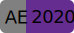

   中文 | <a href="README_en.md">English</a> | <a href="README_ja.md">日本語</a>
   分享跟随oeasy老师学习AE的过程、遇到的问题以及解决方案。 分享自己编写的AE表达式和JSX脚本。

  
  
  
  

### 声明

理性的交流才能促进彼此的进步。

本项目公开的所有源代码都遵循 **CC BY-NC 4.0 署名-非商业性使用** 协议。

### 鸣谢

######  Aescripts KBar V3.1.1 +

